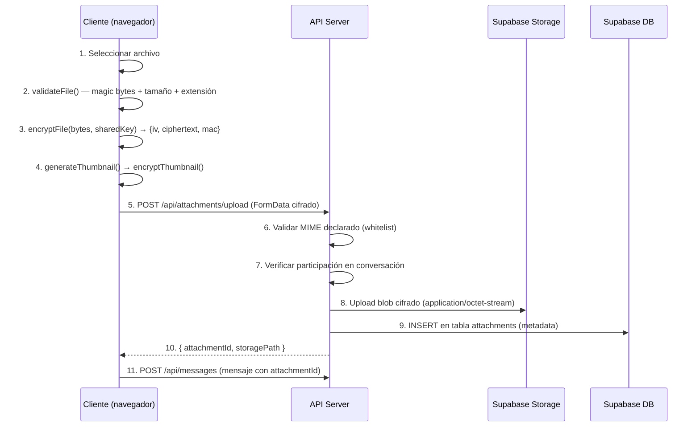
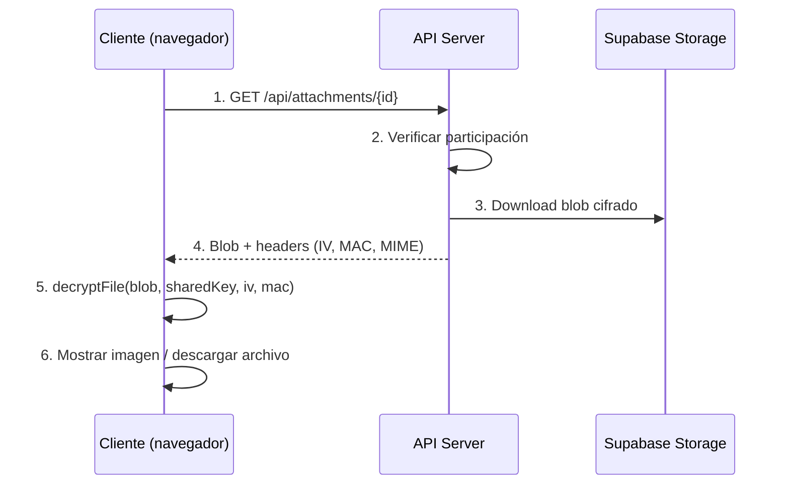

# Módulo de Multimedia Cifrada

> **Responsable:** Christopher (Chris)  
> **Rama:** `feature/multimedia`  
> **Fases del plan:** 11 (Adjuntos cifrados) + 12 (Mensajes de voz)

---

## 1. Arquitectura General

El módulo de multimedia cifrada permite enviar imágenes, archivos y mensajes de voz con cifrado end-to-end (E2E). Todo archivo se cifra **en el cliente** antes de salir del navegador, se sube cifrado a Supabase Storage, y se descifra localmente al recibir.

### Diagrama de flujo — Subida de archivo



### Diagrama de flujo — Descarga de archivo



---

## 2. Cifrado de Archivos

### Algoritmo utilizado

- **AES-256-CBC** con **HMAC-SHA256** (Encrypt-then-MAC)
- Implementación propia desde cero (ver `src/lib/crypto/`)
- Clave: `sharedKey` de 32 bytes derivada de DH + HKDF de la conversación
- IV: 16 bytes aleatorios generados por `crypto.getRandomValues()`

### Esquema Encrypt-then-MAC

1. Derivar claves separadas: `HMAC(masterKey, "enc-key")` y `HMAC(masterKey, "mac-key")`
2. Generar IV aleatorio de 16 bytes
3. Cifrar con AES-256-CBC usando padding PKCS#7
4. Calcular HMAC-SHA256 sobre `IV || ciphertext`
5. Retornar `{iv, ciphertext, mac}` en formato hexadecimal

### Justificación

Encrypt-then-MAC es el esquema composicional correcto según Bellare & Namprempre (2000). Se verifica el MAC **antes** de descifrar, previniendo ataques de padding oracle.

---

## 3. Validación de Archivos

### Validación en el cliente (antes de cifrar)

| Validación | Método | Archivo |
|-----------|--------|---------|
| Tamaño máximo | `fileBytes.length > 25MB` | `file-encrypt.ts` |
| Extensión bloqueada | Set de extensiones peligrosas | `mime-validator.ts` |
| Ejecutable por magic bytes | MZ (EXE), ELF, #! (shebang), etc. | `mime-validator.ts` |
| MIME por magic bytes | Comparar primeros bytes con firmas conocidas | `mime-validator.ts` |
| MIME en whitelist | Solo jpeg, png, webp, pdf, docx, xlsx, webm, ogg | `mime-validator.ts` |

### Validación en el servidor (después de recibir)

El servidor recibe el archivo **ya cifrado**, por lo que no puede verificar magic bytes del contenido original. En su lugar:

- Valida el **MIME declarado** contra whitelist
- Valida la **extensión** del nombre original
- Valida el **tamaño** declarado
- Registra eventos de rechazo en `security_logs`

> ⚠️ **Importante:** La validación de magic bytes DEBE hacerse en el cliente porque el servidor solo ve bytes cifrados. Un cliente malicioso podría saltarse esta validación, pero el servidor igualmente valida metadata declarada como segunda capa de defensa.

### Magic Numbers soportados

| Formato | Magic Bytes | Offset |
|---------|-------------|--------|
| JPEG | `FF D8 FF` | 0 |
| PNG | `89 50 4E 47 0D 0A 1A 0A` | 0 |
| WebP | `52 49 46 46 ... 57 45 42 50` | 0 + 8 |
| PDF | `25 50 44 46` (%PDF) | 0 |
| ZIP (docx/xlsx) | `50 4B 03 04` (PK) | 0 |
| WebM/Matroska | `1A 45 DF A3` | 0 |
| OGG | `4F 67 67 53` | 0 |

### Ejecutables detectados y rechazados

| Tipo | Magic Bytes |
|------|------------|
| Windows EXE/DLL | `4D 5A` (MZ) |
| Linux ELF | `7F 45 4C 46` |
| Shell scripts | `23 21` (#!) |
| Java class | `CA FE BA BE` |
| macOS Mach-O | `FE ED FA CE` / `FE ED FA CF` |

---

## 4. Thumbnails Cifrados

- Se generan en el **cliente** usando Canvas API antes de cifrar
- Tamaño máximo: 320×320 px, formato JPEG 70% de calidad
- Se cifran con IV independiente (separado del archivo principal)
- Se suben como archivo separado a Storage
- Permiten previsualización sin descargar el archivo completo

---

## 5. Mensajes de Voz

### Grabación

- **MediaRecorder API** con formato `audio/webm;codecs=opus`
- Fallback a `audio/webm` o `audio/ogg;codecs=opus`
- Duración máxima: 2 minutos
- Cancelación de micrófono y echo cancellation habilitados

### Waveform en tiempo real

- **Web Audio API** con `AnalyserNode`
- FFT size: 256
- Muestreo: 10 veces por segundo
- Se calcula RMS normalizado de `getByteTimeDomainData()`
- Los datos de waveform se guardan con el attachment para reproducción

### Reproductor

- Renderizado con **Canvas API** (barras redondeadas)
- Play/pause con lazy-loading del audio descifrado
- Seek por click en la waveform
- Velocidades: 1x, 1.5x, 2x
- Progreso visual: barras cambian de color al avanzar la reproducción

### UX de grabación

- Click para iniciar grabación (auto-lock)
- Indicador pulsante rojo + timer
- Mini waveform en tiempo real (últimas 15 muestras)
- Botón cancelar (descarta grabación)
- Botón enviar (cifra y envía)

---

## 6. Logging de Seguridad

Todos los eventos relevantes se registran en `security_logs` via `logMultimediaEvent()`:

| Evento | Cuándo |
|--------|--------|
| `file_uploaded` | Archivo subido exitosamente |
| `file_downloaded` | Archivo descargado |
| `file_type_rejected` | MIME/extensión no permitida |
| `file_size_exceeded` | Archivo supera 25 MB |
| `file_executable_rejected` | Ejecutable detectado por magic bytes |
| `voice_recorded` | Mensaje de voz grabado |

> **Nota:** Los logs NUNCA contienen el contenido del archivo, solo metadata (filename, MIME, tamaño, conversation_id).

---

## 7. Sanitización de Nombres

La función `sanitizeFilename()` previene:

- **Path traversal:** `../../../etc/passwd` → `etc_passwd`
- **Caracteres peligrosos:** `<>:"|?*` → reemplazados por `_`
- **Archivos ocultos:** `.htaccess` → `htaccess`
- **Nombres largos:** Truncados a 200 caracteres preservando extensión
- **Nombres vacíos:** Fallback a `unnamed_file`

---

## 8. Estructura de Archivos

```
src/
├── lib/crypto/
│   ├── file-encrypt.ts          # Cifrado/descifrado de archivos y thumbnails
│   ├── mime-validator.ts        # Validación MIME por magic bytes + sanitización
│   └── __tests__/
│       ├── file-encrypt.test.ts # Tests de cifrado de archivos
│       └── mime-validator.test.ts # Tests de validación MIME
├── app/api/attachments/
│   ├── upload/route.ts          # POST: subida de archivos cifrados
│   └── [id]/route.ts            # GET: descarga de archivos cifrados
├── hooks/
│   ├── useAttachments.ts        # Hook de subida/descarga
│   └── useVoiceRecorder.ts      # Hook de grabación de voz
├── components/chat/
│   ├── AttachmentButton.tsx     # Botón del clip
│   ├── AttachmentPreview.tsx    # Preview en burbujas
│   ├── ImageViewer.tsx          # Modal fullscreen
│   ├── VoicePlayer.tsx          # Reproductor de voz
│   └── VoiceRecordButton.tsx    # Botón de micrófono
└── lib/security/
    └── log-multimedia.ts        # Logging de eventos multimedia
```

---

## 9. Limitaciones Conocidas

1. **Tamaño máximo:** 25 MB por archivo. Archivos más grandes requerirían chunked upload.
2. **MIME en servidor:** El servidor no puede verificar magic bytes del contenido cifrado, solo del MIME declarado.
3. **Thumbnails solo para imágenes:** PDFs y documentos no generan thumbnail.
4. **Formato de voz:** Depende del soporte del navegador. Chrome usa webm/opus, Firefox puede usar ogg/opus.
5. **Waveform almacenada:** Los datos de waveform se guardan como JSON en la BD, lo cual no es ideal para grandes volúmenes.
6. **Sin streaming:** Los archivos se descifran completamente en memoria antes de mostrarse.

---

## 10. Estándares y Referencias

- **AES-256:** FIPS 197
- **CBC Mode:** NIST SP 800-38A
- **HMAC-SHA256:** RFC 2104
- **Encrypt-then-MAC:** Bellare & Namprempre, 2000
- **File signatures:** https://en.wikipedia.org/wiki/List_of_file_signatures
- **MediaRecorder API:** https://developer.mozilla.org/en-US/docs/Web/API/MediaRecorder
- **Web Audio API:** https://developer.mozilla.org/en-US/docs/Web/API/Web_Audio_API
